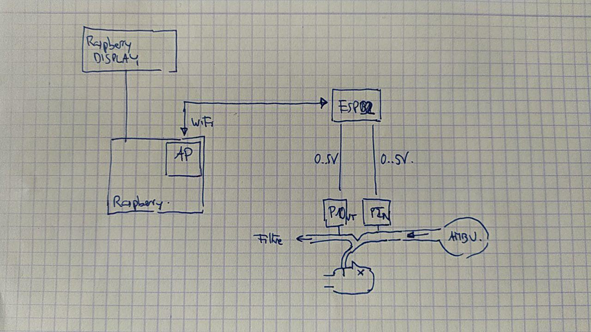

# Monitor

Es tracta de tenir un sistema per monitoritzar diversos respiradors.

## Estructura

Raspberry Pi que funciona com a Acces Point

A cada respirador un ESP 32 que llegeix N senyals analògics (Pin Pout i potser Flow)

Cada ESP envia paquets (UDP?) a la Raspberry

Raspberry guarda i presenta informació

## Elements

### ESP 32

Programat des de Arduino IDE en C++

Llegeix regularment dades analógiques. En fa un processat intern i envia dades de cada
inspiració: 

* Durada cicle (ms)
* Pressió màxima del cicle (cm H2O)
* Pressió mínima del cicle (cm H2O)
* Pressió Plateau durant inspiració (cm H2O)
* Ratio inspiració/espiració (1:x) típicament entre 1:1 1:2
* Pressió al final espiració (cm H2O)

El periode de mostreig hauria de ser 20ms (màxim 60 ms)

Fa un paquet amb identificador del dispositiu i  ABC,T,max,plateau,ratio,peep i l'envia per UDP

### Raspberry Pi

Qualsevol model serveix. 

# Elements a desenvolupar

## Codi ESP

Funcionalitat recollida de dades 

Processat per calcular

Configuració: Abans de posar-lo en servei, cada trasto s'ha de connectar momentàniament 
a un PC per programar-lo amb identificador ABC que vulguin. Això s'ha 
de poder fer "en el camp".

## Core Raspberry

Produir Acces Point

Donar adreces DHCP

*Establir entorn de desenvolupament*: que s'hi puguin connectar ESP's, que s'hi pugi accedir des del 
PC de desenvolupament, que s'hi puguin instal·lar coses

## Aplicació Raspberry

Rebre paquets UDP

Guardar-los. Un fitxer CSV per cada hora i per cada respirador

Presentació d'informació en temps real. Mode text

Presentació de gràfiques en temps real. Mode gràfic

Si apapreix un nou dispositiu, genera gràfica nova

Alarmes configurables. Interfície d'usuari simple

Timer de canvi de filtre. Alarma. Interfície d'usuari

## Accessoris Raspberry

Sistema per generar alarma auditiva. Producció Audio. Altaveu
